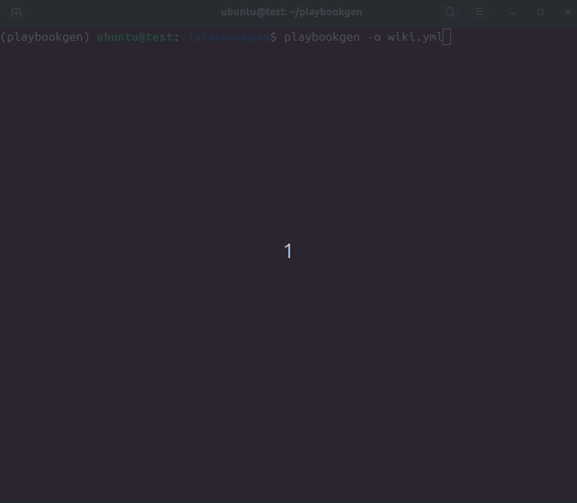

# PlaybookGen

A CLI tool for generating [AttackMate](https://github.com/ait-testbed/attackmate) playbooks using LLMs (currently supports OpenAI's GPT models).

This is a proof of concept and currently can only generate playbooks with the
`browser` and `sleep` [commands of AttackMate](https://aeciddocs.ait.ac.at/attackmate/current/playbook/commands/index.html#commands).

### Setup

1. **Clone the repository** and create a `.env` file in the project root:

   ```env
   OPENAI_API_KEY="your_api_key"
   ```

2. **Install the package** (choose one method):

    <details>
    <summary><strong>With <code>uv</code></strong></summary>
    
    ```bash
    uv venv
    source .venv/bin/activate
    uv pip install -e .
    ```
    
    > ⚠️ Note: `uv pip install` installs into the `.venv` created by `uv venv`, even if the environment isn't manually activated.
    
    </details>
    
    <details>
    <summary><strong>With <code>pip</code></strong></summary>
    
    ```bash
    python -m venv venv
    source venv/bin/activate
    pip install -e .
    ```

    </details>

3. **Install Playwright with its dependencies**:

    ```bash
    playwright install-deps
    playwright install
    ```


### Usage

```bash
playbookgen --help
```

To generate a playbook run the following, then insert prompt and press enter:
```bash
playbookgen --output playbook.yml
```

### Demo


